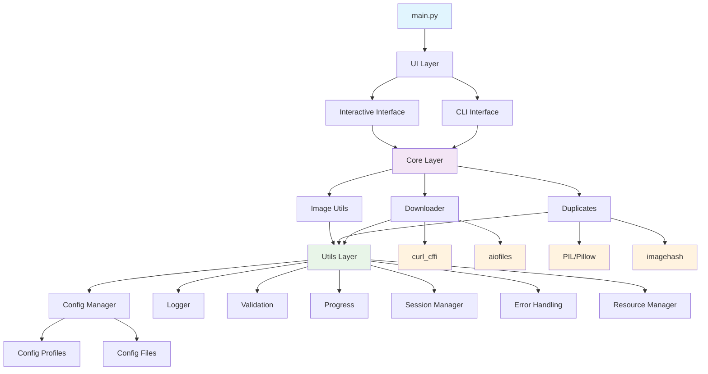
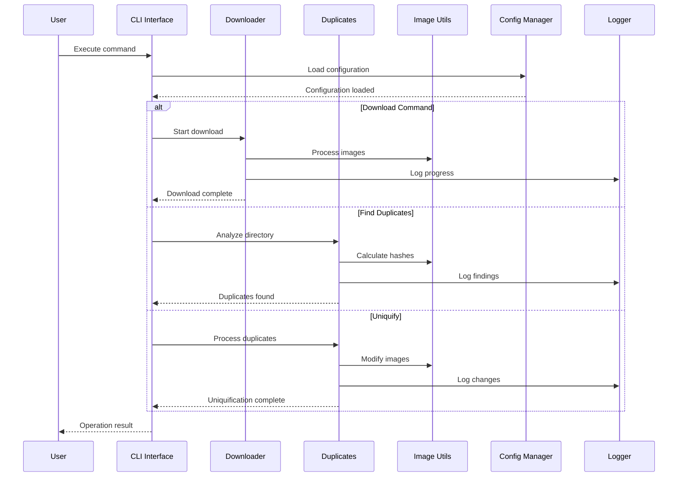
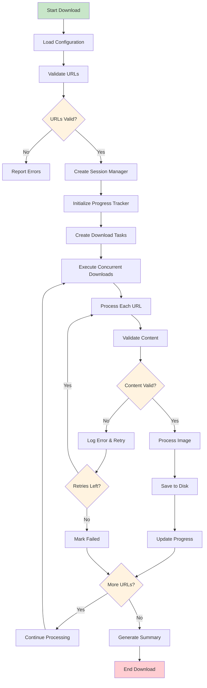
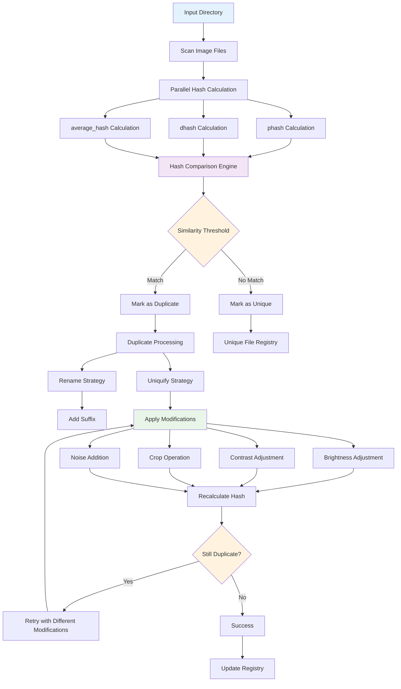
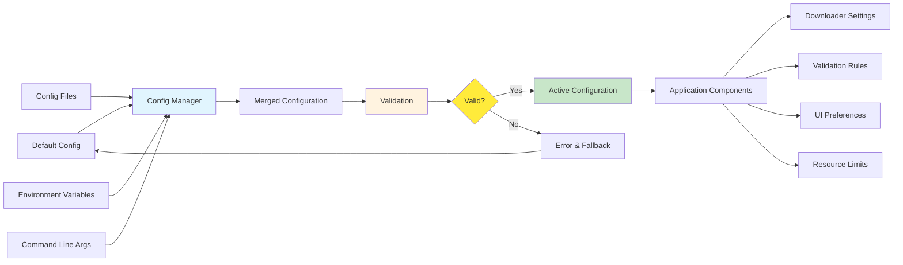
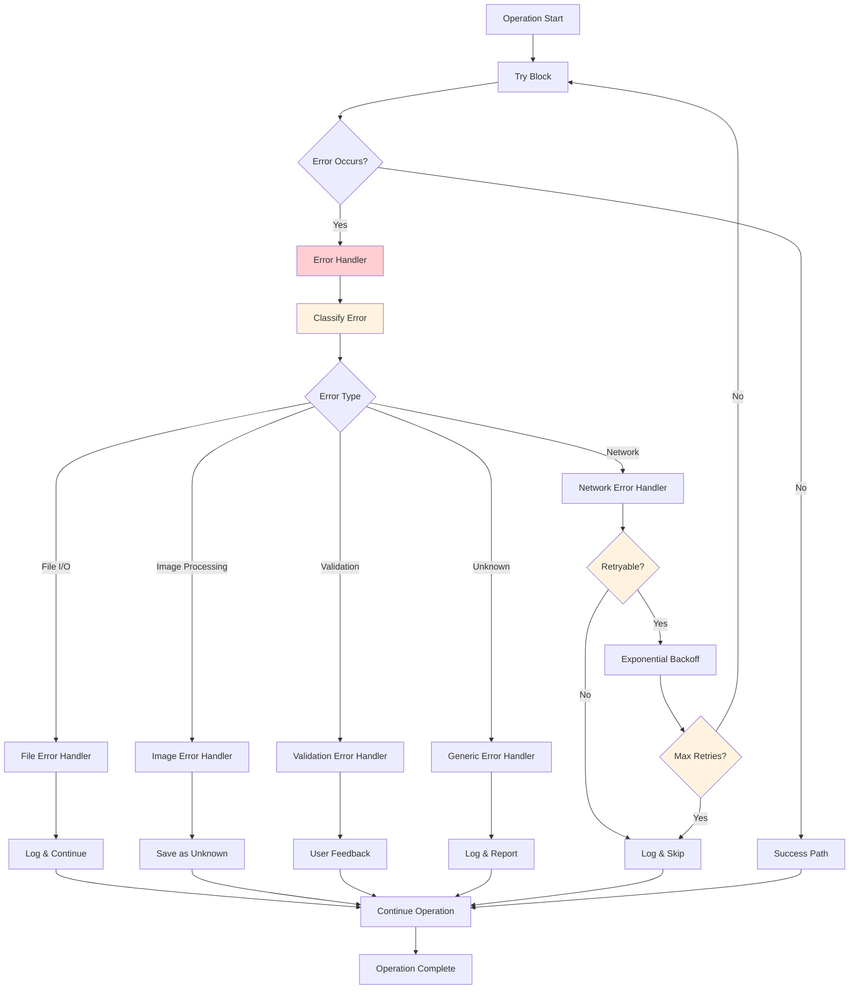
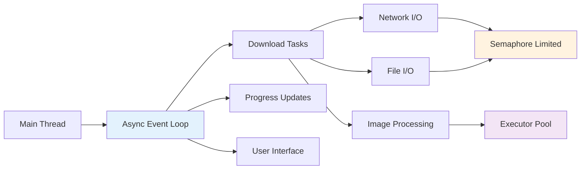
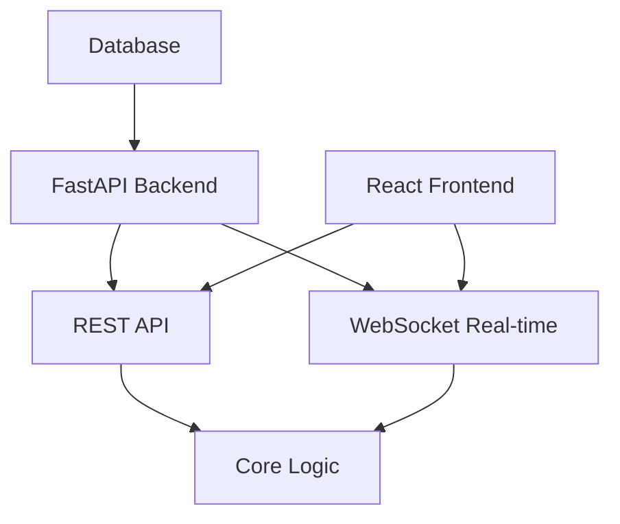
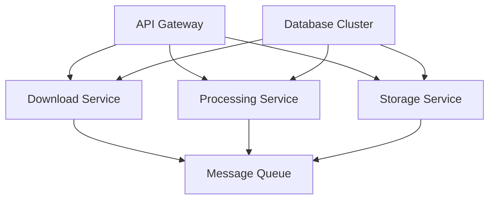
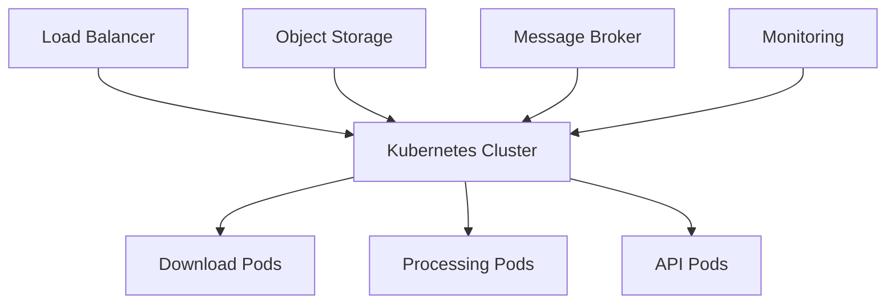

# Async Image Downloader - Architecture Documentation

This document provides a comprehensive overview of the Async Image Downloader's architecture, component interactions, and design patterns.

## 📋 Table of Contents

- [Overview](#overview)
- [System Architecture](#system-architecture)
- [Component Interactions](#component-interactions)
- [Data Flow](#data-flow)
- [Design Patterns](#design-patterns)
- [Module Details](#module-details)
- [Configuration System](#configuration-system)
- [Error Handling Strategy](#error-handling-strategy)
- [Performance Considerations](#performance-considerations)
- [Future Architecture Plans](#future-architecture-plans)

## 🏗 Overview

The Async Image Downloader follows a **modular, asynchronous architecture** built around Python's `asyncio` framework. The system is designed for:

- **High Performance**: Concurrent downloads and processing
- **Reliability**: Robust error handling and retry mechanisms  
- **Extensibility**: Modular design for easy feature additions
- **Usability**: Both CLI and interactive modes
- **Maintainability**: Clear separation of concerns

### Key Architectural Principles

1. **Asynchronous by Design**: All I/O operations are non-blocking
2. **Modular Architecture**: Clear separation of concerns
3. **Configuration-Driven**: Behavior controlled by configuration
4. **Error-First Design**: Comprehensive error handling at all levels
5. **Resource-Aware**: Memory and file descriptor management

## 🏛 System Architecture



## 🔄 Component Interactions

### High-Level Component Flow



### Download Workflow Detail



### Duplicate Detection Architecture



## 📊 Data Flow

### Configuration Data Flow



### Error Handling Flow



## 🎯 Design Patterns

### 1. Command Pattern
The CLI interface implements the Command pattern for handling different operations:

```python
# Each command is encapsulated as a separate function
async def download_command(urls, start_index, retries)
async def find_duplicates_command(directory)
async def uniquify_command(directory)
```

### 2. Strategy Pattern
Different image modification strategies are implemented as pluggable functions:

```python
def _modify_brightness(image: Image) -> Image
def _modify_contrast(image: Image) -> Image
def _modify_crop(image: Image) -> Image
def _modify_add_noise(image: Image) -> Image
```

### 3. Observer Pattern
Progress tracking uses an observer-like pattern to update UI:

```python
class ProgressTracker:
    def update(self, progress_data)
    def notify_completion(self, results)
```

### 4. Singleton Pattern
Configuration and logging use singleton-like patterns:

```python
config_manager = ConfigManager()  # Global instance
logger = setup_logger()           # Shared logger
```

### 5. Factory Pattern
Configuration profiles use factory methods:

```python
class ConfigProfiles:
    @staticmethod
    def create_fast_download_profile() -> AppConfig
    @staticmethod
    def create_seo_optimization_profile() -> AppConfig
```

## 🧩 Module Details

### Core Modules

#### `core/downloader.py`
**Responsibility**: Asynchronous image downloading
- **Key Functions**: `download_images()`, `download_file()`, `handle_and_save_response()`
- **Dependencies**: curl_cffi, aiofiles, utils modules
- **Concurrency**: Uses semaphore to limit concurrent downloads
- **Error Handling**: Retry mechanism with exponential backoff

#### `core/duplicates.py`
**Responsibility**: Duplicate detection and processing
- **Key Functions**: `handle_duplicates()`, `uniquify_duplicates()`, `uniquify_all_images()`
- **Algorithm**: Multi-hash comparison (phash, dhash, average_hash)
- **Performance**: O(n log n) optimization using hash indexing
- **Safety**: Backup creation before modifications

#### `core/image_utils.py`
**Responsibility**: Image processing and hashing
- **Key Functions**: `process_and_save_image_sync()`, `get_file_hashes()`, modification functions
- **Formats**: JPEG, PNG, WebP, GIF support
- **Optimization**: Executor usage for CPU-bound operations
- **Quality**: Configurable image quality settings

### Utility Modules

#### `utils/config_manager.py`
**Responsibility**: Configuration management
- **Features**: JSON/YAML support, validation, profiles
- **Pattern**: Singleton-like global instance
- **Flexibility**: Runtime configuration updates
- **Safety**: Configuration validation and fallbacks

#### `utils/session_manager.py`
**Responsibility**: Download session management
- **Features**: Pause/resume, progress persistence
- **State**: JSON-based state storage
- **Recovery**: Automatic session restoration
- **Control**: User interaction handling

#### `utils/progress.py`
**Responsibility**: Progress tracking and display
- **UI**: Rich progress bars with statistics
- **Async**: Non-blocking progress updates
- **Flexibility**: Multiple progress bar styles
- **Information**: Speed, ETA, completion statistics

### UI Modules

#### `ui/cli.py`
**Responsibility**: Command-line interface
- **Modes**: Interactive and command-line modes
- **Validation**: Input validation and error messages
- **Help**: Comprehensive help system
- **Integration**: Seamless integration with core modules

## ⚙️ Configuration System

### Configuration Hierarchy

```mermaid
graph TD
    A[Command Line Arguments] --> B[Environment Variables]
    B --> C[Configuration Files]
    C --> D[Configuration Profiles]
    D --> E[Default Values]
    
    F[Final Configuration] <-- A
    F <-- B
    F <-- C
    F <-- D
    F <-- E
    
    style A fill:#ff9800
    style F fill:#4caf50
```

### Configuration Structure

```yaml
# Example configuration structure
download:
  max_concurrent_downloads: 50
  download_timeout: 30
  default_retries: 3
  enable_pause_resume: true

paths:
  image_dir: "./images"
  temp_dir: "./temp"
  log_file: "app.log"

validation:
  max_download_size_mb: 100
  min_file_size: 100
  allowed_schemes: ["http", "https"]

duplicates:
  similarity_threshold: 2
  max_uniquify_attempts: 10
  auto_confirm_operations: false

ui:
  show_welcome_message: true
  progress_bar_style: "default"
  error_details_level: "medium"
```

## 🚨 Error Handling Strategy

### Error Classification

1. **Network Errors**: Connection timeouts, HTTP errors
2. **File System Errors**: Permission issues, disk space
3. **Image Processing Errors**: Corrupted files, unsupported formats
4. **Validation Errors**: Invalid URLs, configuration errors
5. **Resource Errors**: Memory exhaustion, file descriptor limits

### Recovery Strategies

- **Automatic Retry**: For transient network errors
- **Graceful Degradation**: Continue processing other items
- **User Notification**: Clear error messages and suggestions
- **State Preservation**: Save progress for resumption
- **Fallback Options**: Alternative processing methods

## 🚀 Performance Considerations

### Concurrency Model



### Optimization Techniques

1. **Connection Pooling**: Reuse HTTP connections
2. **Semaphore Limiting**: Control concurrent operations
3. **Executor Usage**: CPU-bound tasks in separate threads
4. **Memory Management**: Streaming downloads, cleanup
5. **Hash Indexing**: O(n log n) duplicate detection
6. **Lazy Loading**: Load resources only when needed

### Resource Management

- **Memory**: Streaming downloads, periodic cleanup
- **File Descriptors**: Proper session management
- **CPU**: Balanced async/sync processing
- **Disk Space**: Temporary file cleanup
- **Network**: Rate limiting and retries

## 🔮 Future Architecture Plans

### Phase 1: Web Interface


### Phase 2: Microservices


### Phase 3: Cloud Native


---

**Last Updated**: August 24, 2024  
**Version**: 2.1.1  
**Authors**: Project Contributors