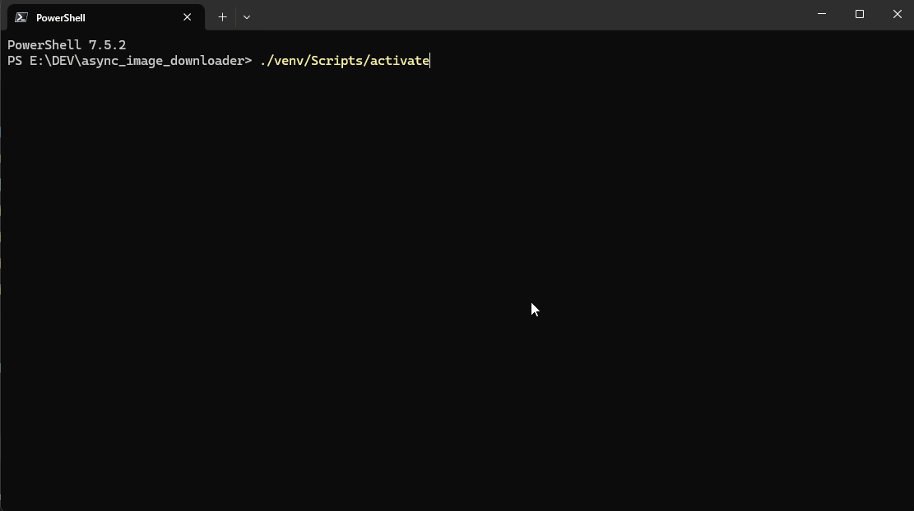

# Async Image Downloader and Processor

Этот проект представляет собой асинхронный инструмент командной строки для скачивания изображений и управления дубликатами. Он поддерживает как автоматизированный режим через аргументы командной строки, так и интерактивный режим для удобного использования человеком.



## Содержание
- [Быстрый старт](#быстрый-старт)
- [Проблема](#проблема)
- [Решение](#решение)
- [Последние изменения](#последние-изменения)
- [Особенности](#особенности)
- [Установка](#установка)
- [Использование](#использование)
  - [Интерактивный режим](#интерактивный-режим)
  - [Режим командной строки-cli](#режим-командной-строки-cli)
- [Как это работает](#как-это-работает)
- [Планы на будущее](#планы-на-будущее)
- [Лицензия](#лицензия)

## Быстрый старт

### Вариант 1: Готовый исполняемый файл
1. Скачайте последнюю версию программы из раздела [Releases](https://github.com/mrfadzay/async_image_downloader/releases)
2. Распакуйте архив в любую папку
3. Запустите `image_tool.exe`
4. Следуйте инструкциям в интерактивном меню

### Вариант 2: Запуск из исходного кода
1. Клонируйте репозиторий: `git clone https://github.com/mrfadzay/async_image_downloader.git`
2. Установите зависимости: `pip install -r requirements.txt`
3. Запустите программу: `python main.py`

## Проблема

При работе с наполнением сайтов, интернет-магазинов или блогов контент-менеджеры часто сталкиваются с необходимостью скачивать сотни изображений из разных источников. Этот процесс включает в себя:
*   Ручное скачивание каждого файла.
*   Сортировку изображений по папкам.
*   Поиск и удаление визуально одинаковых картинок, которые могут быть загружены под разными именами или из разных источников.
*   Необходимость сделать изображения "уникальными" для поисковых систем, избегая санкций за дублированный контент.

Эти задачи отнимают много времени и подвержены человеческим ошибкам.

## Решение

**Async Image Downloader** автоматизирует весь этот процесс. Это консольный инструмент, который позволяет:

*   **Массово скачивать изображения** по списку URL, вставленному напрямую в интерактивном режиме или переданному в командной строке.
*   **Автоматически находить визуальные дубликаты** с помощью перцептивного хеширования и переименовывать их для дальнейшей проверки.
*   **"Уникализировать" дубликаты** путем внесения незначительных изменений (яркость, контраст, обрезка), которые делают файл технически уникальным, но сохраняют его визуальное качество.

Инструмент имеет два режима работы, что делает его удобным как для ручного использования, так и для интеграции в автоматизированные скрипты.

[Полная история изменений в CHANGELOG.md](CHANGELOG.md)

## Особенности

*   **Эффективное скачивание изображений:**
    * Оптимизированное параллельное скачивание с использованием `curl_cffi`
    * Автоматическая обработка ошибок и повторные попытки
    * Быстрая параллельная загрузка (~50 одновременных соединений)
*   **Асинхронная архитектура:** Эффективно скачивает и обрабатывает изображения благодаря `asyncio`.
*   **Продвинутая обработка дубликатов:**
    *   **Поиск и переименование:** Находит визуальные дубликаты с помощью комбинации трех алгоритмов хеширования.
    *   **Уникализация:** Модифицирует изображения (яркость, контраст, обрезка, шум) для создания технически уникальных файлов.
*   **Два режима работы:**
    *   **Режим командной строки (CLI):** Идеально подходит для автоматизации, использования в скриптах, cron-задачах или CI/CD пайплайнах.
    *   **Интерактивный режим:** Удобное меню с подсказками для ручного использования, не требующее запоминания всех флагов.
*   **Надёжность:** Автоматические повторные попытки при ошибках скачивания и корректная обработка путей с кириллицей и пробелами.

## Установка

1.  **Клонируйте репозиторий:**
    ```bash
    git clone https://github.com/mrfadzay/async_image_downloader.git
    cd async_image_downloader
    ```

2.  **Установите зависимости:**
    ```bash
    pip install -r requirements.txt
    ```

3.  **Создание исполняемого файла (опционально):**
    ```bash
    pip install pyinstaller
    pyinstaller image_tool.spec
    ```
    Исполняемый файл будет создан в папке `dist`.

## Использование

### Интерактивный режим

Просто запустите скрипт без каких-либо аргументов, и он предложит вам выбрать действие:

```bash
python main.py
```

Или запустите исполняемый файл:

```bash
image_tool.exe
```

Вы увидите меню с опциями:
*   Скачать изображения
*   Работа с дубликатами
*   Уникализация
*   Выход

Скрипт будет задавать дополнительные вопросы в зависимости от вашего выбора.

### Режим командной строки (CLI)

Вы можете использовать следующие команды с аргументами для автоматизации задач:

#### 1. Скачивание изображений (`download`)

Скачивает изображения по списку URL, переданных напрямую в командной строке.

**Синтаксис:**
```bash
python main.py download [OPTIONS] URL [URL...]
```

**Аргументы:**
*   `URLS`: Один или несколько URL-адресов для скачивания, разделенных пробелами. Рекомендуется заключать URL в кавычки, если они содержат специальные символы.

**Опции:**
*   `-s, --start-index <ЧИСЛО>`: Начальный индекс для именования файлов (по умолчанию: 1000).
*   `--retries <ЧИСЛО>`: Количество повторных попыток при ошибках (по умолчанию: 3).

**Примеры:**

*   **Простое скачивание:**
    ```bash
    python main.py download https://example.com/img1.jpg https://example.com/img2.png
    ```

*   **Скачивание с указанием начального индекса:**
    ```bash
    python main.py download --start-index 1 "https://imgur.com/1.jpg" "https://imgur.com/2.jpg"
    ```

#### 2. Поиск и переименование дубликатов

Эта команда найдет дубликаты изображений в указанной директории и переименует их, добавляя суффикс `_duplicate_N`.

```bash
python main.py find-duplicates images/my_downloads
```
*(Замените `images/my_downloads` на путь к вашей директории)*

#### 3. Уникализация дубликатов

Эта команда найдет дубликаты изображений в указанной директории и попытается модифицировать их, чтобы сделать уникальными.

```bash
python main.py uniquify images/my_downloads
```
*(Замените `images/my_downloads` на путь к вашей директории)*

#### 4. Уникализация всех изображений

Эта команда уникализирует все изображения в указанной директории (не только дубликаты), применяя к каждому изображению случайные модификации.

```bash
python main.py uniquify-all images/my_downloads
```
*(Замените `images/my_downloads` на путь к вашей директории)*

## Как это работает

Проект использует `asyncio` для асинхронных операций ввода-вывода и `curl_cffi` с имитацией браузера Chrome для эффективного скачивания файлов и обхода защиты сайтов. 

Для определения дубликатов используется комбинация трех алгоритмов хеширования из библиотеки `imagehash`:
- perceptual hash (phash)
- difference hash (dhash)
- average hash (average_hash)

Изображение считается дубликатом, если как минимум 2 из 3 хешей совпадают. Это позволяет находить визуально похожие изображения с высокой точностью, даже если они были слегка изменены.

При уникализации дубликатов программа применяет несколько модификаций одновременно (яркость, контраст, обрезка, добавление шума), что повышает шанс сделать изображение уникальным с первой попытки.

## Планы на будущее

В будущих версиях планируется:
- Конвертация инструмента в веб-приложение с использованием FastAPI
- Добавление графического интерфейса для более удобного использования
- Расширение функциональности по обработке изображений

## Лицензия

Этот проект распространяется под лицензией MIT. См. файл `LICENSE` для получения дополнительной информации.
